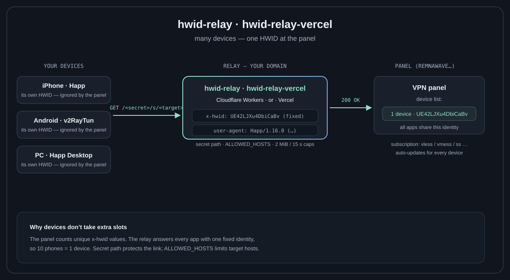

# happ-relay-cloudflare-vercel

[](https://github.com/cylaro/happ-relay-cloudflare-vercel/actions/workflows/test.yml)
[](https://vercel.com/new/clone?repository-url=https%3A%2F%2Fgithub.com%2Fcylaro%2Fhapp-relay-cloudflare-vercel)

**A one-file subscription relay on Vercel: connect many devices to a panel with a HWID device limit — the panel sees exactly one device.**

[Инструкция на русском](README.ru.md)

## Why

Panels such as [Remnawave](https://docs.rw/features/hwid-device-limit) count unique `x-hwid` header values per user, and client apps generate a different value per device. Ten devices become ten "devices" and hit the limit. Since the header is generated by the client, you cannot change it in the app — but you can change **where the app connects**:



Apps keep working normally — the relay is a plain HTTPS endpoint that returns the subscription with your fixed identity.

## Deployment

### 1. Deploy to Vercel

Press the **Deploy** button above, or [vercel.com/new](https://vercel.com/new) → import this repository (Framework Preset: **Other**) → **Deploy**.

### 2. Set the environment variables

Project → **Settings** → **Environment Variables** → add (type **Plain Text** or **Secret**, environment **Production**):

| Name | Example | Required |
|---|---|---|
| `SECRET_PREFIX` | `kR9wTz4QmB7x` | yes (8+ chars, random — part of your links; keep private) |
| `HWID` | `UE42LJXu4DbiCaBv` | yes (10–64 chars `A-Z a-z 0-9 = -`) |
| `USER_AGENT` | `Happ/1.16.0 (iOS 18.3; iPhone 14 Pro)` | yes |
| `ALLOWED_HOSTS` | `panel-provider.com,other-panel.net` | optional (empty = any https host; comma-separated, spaces are trimmed) |
| `DEVICE_OS` / `VER_OS` / `DEVICE_MODEL` | `iOS` / `18.3` / `iPhone 14 Pro` | optional |

After changing variables, open **Deployments** → the latest deployment → **⋯ → Redeploy** — variables apply to new deployments only.

### 3. Attach a domain

Project → **Settings → Domains** → **Add** → your domain.

> **Use your own domain with an A record (`216.198.79.1`), DNS-only — not the default `*.vercel.app`.**
> The default `vercel.app` domain is unreachable from some networks (notably Russian ISPs), and Cloudflare-proxied setups add an AAAA (IPv6) record that breaks clients without an IPv4 fallback. An A-only, DNS-only record keeps the relay reachable everywhere.

Cloudflare as DNS: zone → **DNS → Records** → A record `@` (or a subdomain) → `216.198.79.1` → **DNS only** (grey cloud).

## Usage

Two link forms work side by side:

```text
Subscription: https://your-domain.tld/<secret>/s/https://panel-provider.com/sub/<token>
Health:       https://your-domain.tld/<secret>/health
```

- The **secret prefix** is your private key: links without it return 404.
- **`ALLOWED_HOSTS`** (comma-separated, spaces are trimmed) limits which panel hosts the relay may fetch — safer if the link leaks. Empty means any https host.
- Add the subscription URL in any client (Happ, v2RayTun, Streisand, Karing, …). Every device using this URL counts as **one device** at the panel, and updates flow normally.

To verify the identity before connecting devices, use the Request tab of [happ-decryptor](https://github.com/cylaro/happ-decryptor): send the panel URL with the same headers and check the response.

## Notes

- The relay is a plain HTTPS pipe: GET in, subscription out, no logging, no storage.
- Vercel Hobby (free) plan is sufficient for personal use (1M invocations, 100 GB transfer per month).

## Related projects

- [happ-decryptor](https://github.com/cylaro/happ-decryptor) — decrypt `happ://crypt…` links, edit subscription URLs, send requests with device headers.
- [happ-relay-cloudflare](https://github.com/cylaro/happ-relay-cloudflare) — the same relay on Cloudflare Workers, if you prefer that platform.

## Support / Donate

If this project helped you, consider a donation — **USDT on the TON network**:

```text
UQCcN9hahBxM5q3GGwx79UNEu82EF0kFTwnRRklL_1OLtK15
```

## Disclaimer

Educational project. You are responsible for complying with your provider's terms of service and applicable law. Not affiliated with Happ or Remnawave. No warranty — see [LICENSE](LICENSE).
